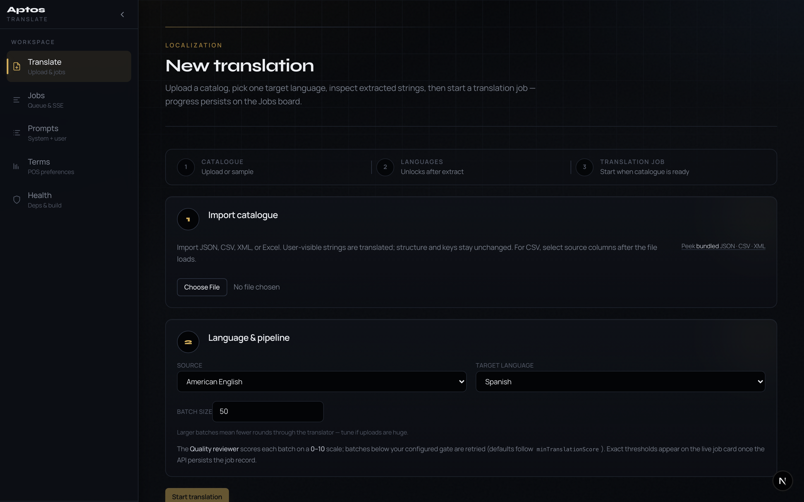

# TranslateAIv2

Aptos Translate AI v2 monorepo.

**New machine?** Start here → **[GETTING_STARTED.md](GETTING_STARTED.md)**

| Document | Audience |
|----------|----------|
| [docs/ARCHITECTURE.md](docs/ARCHITECTURE.md) | Engineers — stack blueprint & module map |
| [docs/USER_GUIDE.md](docs/USER_GUIDE.md) | Operators & localization — workflows, UI, troubleshooting |
| [docs/ARCHITECTURAL_SIGNOFF.md](docs/ARCHITECTURAL_SIGNOFF.md) | Engineering / security / ops — as-built sign-off package |
