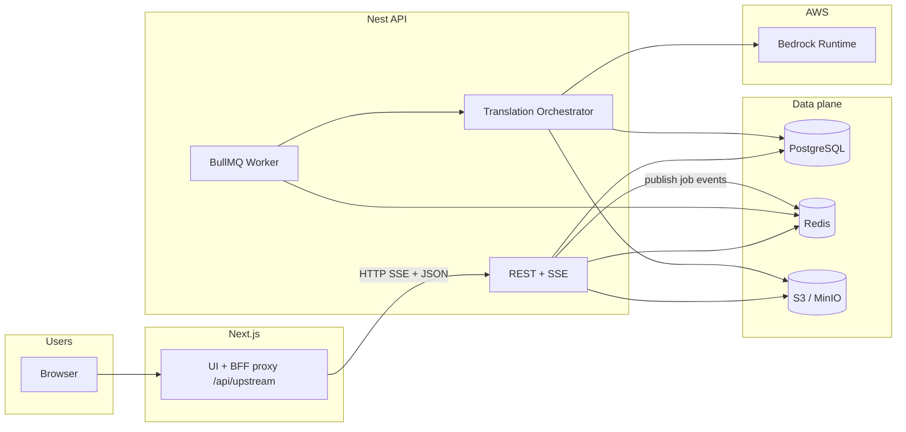

# Aptos Translate AI v2 — Architectural Sign-Off Document

**Document type:** Architecture description + sign-off package  
**Audience:** Engineering leads, security review, operations, compliance stakeholders  
**Companion docs:** `docs/ARCHITECTURE.md` (blueprint), `docs/USER_GUIDE.md` (operators)  
**Source of truth for APIs:** NestJS OpenAPI (`/api/openapi.json`) and `packages/contracts`

---

## 1. Executive summary

TranslateAIv2 is a **monorepo** delivering a **Next.js 15** web UI and a **NestJS 11 (Fastify)** API for **batch translation** of POS/catalog files. Work is queued in **BullMQ (Redis)**, persisted in **PostgreSQL (Prisma)**, and files live in **S3-compatible** storage. Each batch runs **Amazon Bedrock Converse** twice in sequence: **translator** then **judge**; batches may **retry** on low scores up to a configured cap. The system is **multi-tenant at the data model** (`tenantId` on core tables) with a **TenantGuard** that requires **`X-Tenant-Id`** (or `tenantId` query for SSE).

This document is suitable for **technical sign-off**: it states as-built behavior, boundaries, risks, and gaps versus the aspirational blueprint in `docs/ARCHITECTURE.md`.

---

## 2. Purpose & scope

| In scope | Out of scope (unless explicitly added elsewhere) |
|----------|--------------------------------------------------|
| Web UI for translate wizard, jobs, prompts, glossary, health | Multi-region active-active DR design |
| Nest API: jobs, files, translation orchestration, extractors, regenerators, Bedrock adapters, health | Full SOC2 control matrix mapping |
| Prisma schema & migrations | Vendor-specific contract negotiation (AWS enterprise agreement) |
| Docker Compose for local/staging-style stacks | Production Kubernetes manifests (see `infra/terraform` for direction only) |
| BullMQ single-queue worker in API process | Separate worker fleet autoscaling policy (recommended for large scale) |

---

## 3. Sign-off matrix (template)

| Role | Name | Date | Signature / link |
|------|------|------|-------------------|
| Engineering lead | | | |
| Security | | | |
| Operations / SRE | | | |
| Product owner | | | |
| Data protection (if applicable) | | | |

*Complete after review of sections 5–16.*

---

## 4. System context

**Notes:**

- The **same** Node process typically runs HTTP **and** the BullMQ **consumer** (`TranslateWorkerService`) unless `DISABLE_TRANSLATE_WORKER=true`.
- **SSE** uses Redis **pub/sub** channels `job:{jobId}`; subscribers are short-lived per HTTP connection.

---

## 5. Requirements traceability (as-built)

| ID | Requirement | Implementation | Verification |
|----|---------------|----------------|--------------|
| R1 | Multi-tenant data isolation | `tenantId` on `Job`, `JobBatch`, `PromptTemplate`, `TermPreference`; queries scoped in services; `TenantGuard` | Code review + integration tests (recommended) |
| R2 | Large file support | Presigned S3 upload; extractors stream where implemented | Load test with large XML/JSON |
| R3 | Translator ≠ judge | `BedrockTranslatorService` vs `BedrockScorerService`; separate model env vars | Health deps shows two probes |
| R4 | Batched processing | `chunk(extracted.originals, batchSize)` + `mapPool` concurrency | Job logs + `JobBatch` rows |
| R5 | Retries on low judge score | `while (attempt < maxRetries)` re-translate path; diagnostics logged | SSE + server logs |
| R6 | Job progress to UI | `JobEventsService.publish` + Prisma `Job.progress` / `status` | Manual UI test |
| R7 | Cancellable jobs | `status: cancelled` + `removeWaitingJob` + orchestrator checks | Cancel from UI |
| R8 | Regenerated artifacts | `RegeneratorsService` + S3 `putObjectBytes` | Download outputs |
| R9 | QA audit trail | `*.qa-bundle.json` + `*.translation-review.csv` | Open bundle in editor |
| R10 | Configurable prompts | `PromptsService` + `PromptTemplate` CRUD | PUT/GET prompts API |

---

## 6. As-built component architecture

| Component | Path (typical) | Responsibility |
|-----------|----------------|------------------|
| **JobsController** | `apps/api/src/jobs/jobs.controller.ts` | CRUD jobs, SSE `:id/events`, cancel, batch diagnostics |
| **JobsService** | `apps/api/src/jobs/jobs.service.ts` | Prisma create + enqueue BullMQ |
| **TranslateQueueService** | `apps/api/src/jobs/translate-queue.service.ts` | BullMQ `Queue`; `add` with `jobId` dedupe key |
| **TranslateWorkerService** | same file | `Worker` → `TranslationOrchestratorService.run(jobId)` |
| **TranslationOrchestratorService** | `apps/api/src/translation/translation-orchestrator.service.ts` | S3 get → extract → per-target batches → translate → score → retry logic → regenerate → S3 put |
| **ExtractorsService** | `apps/api/src/extractors/` | Format-specific parsers + `extractOptions` |
| **RegeneratorsService** | `apps/api/src/regenerators/` | Merge translations back into file bodies |
| **TranslationRouterService** | `apps/api/src/llm/translation-router.service.ts` | Route translator “kind” (Bedrock default) |
| **BedrockConverseService** | `apps/api/src/llm/bedrock-converse.service.ts` | Shared Converse API + retries; `maxRetriesOverride` for health |
| **BedrockTranslatorService** | `apps/api/src/llm/bedrock-translator.service.ts` | JSON batch translation contract |
| **BedrockScorerService** | `apps/api/src/scoring/bedrock-scorer.service.ts` | JSON scoring; soft-fail returns neutral scores on parse errors |
| **HealthService** | `apps/api/src/health/health.service.ts` | Parallel `getDeps`: PG, Redis, S3, dual Bedrock pings |
| **JobEventsService** | `apps/api/src/common/job-events/job-events.service.ts` | Redis pub for SSE |
| **FilesService** | `apps/api/src/files/` | Presigned URLs + object get/put |
| **Web proxy** | `apps/web/src/app/api/upstream/[...path]/route.ts` | Server-side forward to Nest |

---

## 7. Data architecture

### 7.1 Core entities (Prisma)

- **`Tenant`** — `activeTranslator`, `activeScorer` string slugs (default `bedrock`).
- **`User`** — `email`, `tenantId` (OAuth mapping is deployment-specific).
- **`Job`** — `fileKey`, `sourceLang`, `targetLangs[]`, `batchSize`, `minTranslationScore`, `maxBatchRetries`, `progress`, `stringsTotal`, `batchTotal`, `resultUrls[]`, `extractOptions` JSON, `status` enum.
- **`JobBatch`** — one row per `(jobId, batchIndex)` with `attempt`, `judgeScore`, `lastErrorCode` (`SCORE_LOW`, `SCORING_FAILED`, etc.).
- **`PromptTemplate`** — unique `(tenantId, sourceLang, targetLang)` with `version`.
- **`TermPreference`** — glossary rows indexed by tenant + languages + `sourceTerm`.

### 7.2 Object storage layout (convention)

Results are written under keys such as:

`results/{tenantId}/{jobId}/{targetLang}.{ext}` and companion QA files (`*.qa-bundle.json`, `*.translation-review.csv`).

### 7.3 Consistency model

- **Job row** is updated for aggregate `progress` / `status` under a mutex for parallel batch workers to avoid clobbering progress semantics.
- **JobBatch** upserts reflect the **latest** attempt for that batch index.

---

## 8. Security & trust boundaries

| Topic | As-built behavior | Risk / note |
|-------|-------------------|-------------|
| **Tenant isolation** | Application-level `where: { tenantId }`; guard injects `tenantId` from header/query | No row-level security in Postgres by default — **DB access** must be trusted |
| **Secrets** | Bedrock uses IAM / instance credentials; S3 uses env keys or IAM | Never expose `AWS_*` or `S3_SECRET_*` to browser |
| **Browser → API** | Next proxy can attach same headers the UI sends | Ensure **production** auth replaces dev tenant header |
| **SSE** | `tenantId` query param for EventSource | Susceptible to **leaked job URLs** if UUID guessed — mitigate with auth at edge + short-lived tokens in mature deployments |
| **File content** | Customer catalog may contain PII — treat S3 bucket as **sensitive** | Encryption at rest (S3), TLS in transit, retention policy |

---

## 9. Scalability & performance

| Knob | Location | Guidance |
|------|----------|----------|
| `TRANSLATION_BATCH_CONCURRENCY` | API env | Parallel in-flight **batches per job per target** (default 8, max 24). Bounded by Bedrock TPS and account quotas. |
| `TRANSLATE_WORKER_CONCURRENCY` | `translate-queue.service.ts` | Parallel **jobs** per API process (default 1). |
| `batchSize` | Per job | Latency vs throughput tradeoff; affects judge JSON size. |
| BullMQ | Redis | Single queue name `translate-job`; horizontal scale = multiple API/worker processes **same Redis** + tuned concurrency |
| Health `getDeps` | `HealthService` | Parallel probes; Bedrock health uses **single attempt** to avoid long backoff |

**Post-pass:** `preserveUiCatalogMarks` (leading Win32 `&`, Hindi `Str` token repair) runs on translations before scoring — deterministic quality hardening.

---

## 10. Failure modes & mitigations

| Failure | System response | Mitigation / ops action |
|---------|-----------------|-------------------------|
| Bedrock throttle / timeout | `BedrockConverseService` retries with backoff (translation path) | Lower batch concurrency; request quota increase; regional endpoint |
| Judge returns empty / bad JSON | Scorer may return **5.0** + “Scoring failed” notes; may trigger retries | Change `BEDROCK_SCORING_MODEL_ID`; inspect health judge probe |
| Low scores after max retries | Job **completes**; QA flags failures | Tune prompts/threshold; human review CSV |
| Redis unavailable | Queue cannot run; SSE publish may warn | Redis HA; monitor |
| Postgres down | Jobs fail at extract/update | DB HA; connection pool sizing |
| S3 head bucket fails | Health shows S3 down; jobs fail at I/O | Credentials, endpoint, bucket policy |

---

## 11. Observability

| Signal | Status |
|--------|--------|
| **Structured logs** | Nest `Logger` on orchestrator, worker, Bedrock — **retry reasons** logged at `warn` |
| **SSE job feed** | UI timeline for operators |
| **OpenTelemetry** | Env placeholders in root `.env.example` — **wire-up is deployment-specific** |
| **Metrics / tracing** | Blueprint mentions Grafana stack — **confirm actual deployment** |

**Sign-off action:** Record which OTLP endpoint and dashboards are **actually** configured in production.

---

## 12. Deployment reference

### 12.1 Docker Compose (`docker-compose.yaml`)

- **postgres** — port 5432, DB `aptos_translate`.
- **redis** — AOF enabled.
- **minio** — profile `full`; console 9001.
- **api** / **web** — profile `full`; web uses `API_PROXY_TARGET: http://api:3001`.

### 12.2 Environment separation

| Tier | Typical settings |
|------|------------------|
| Local | `127.0.0.1` targets, MinIO optional |
| Staging | Managed Postgres/Redis/S3; Bedrock in same account or sandbox |
| Production | Private subnets, IAM roles for Bedrock/S3, secrets manager |

---

## 13. Blueprint vs implementation (known gaps)

Items from `docs/ARCHITECTURE.md` that are **aspirational** or **partially** implemented — verify before marketing to customers:

| Blueprint item | Implementation note |
|----------------|---------------------|
| OpenTelemetry → Grafana | OTEL env vars exist; full stack not defined in repo alone |
| Health “sparklines / 24h LLM latencies” | **Health page** is grid + build info; no historical charts in repo |
| Auth.js + Passport JWT | **TenantGuard** prototype is header/query based; full auth integration is deployment-specific |
| `GET /version/web` | Web build info may be exposed differently — check Next routes |
| Placeholder mismatch error code `PLACEHOLDER_MISMATCH` | Schema comment example; **orchestrator may not emit all listed codes yet** — treat `lastErrorCode` as extensible |
| Horizontal “many workers” | Supported by architecture **if** multiple processes share Redis + DB; **not** auto-configured in compose |

---

## 14. Compliance & data handling (checklist)

- [ ] **Data residency:** Bedrock region + S3 region documented for customer contracts.
- [ ] **Retention:** Job rows + S3 objects lifecycle policy defined.
- [ ] **Encryption:** S3 SSE-KMS or default SSE-S3; TLS for all HTTP.
- [ ] **Access logging:** S3 server access logs / CloudTrail for Bedrock (AWS).
- [ ] **Right to erasure:** Process to delete `Job`, `JobBatch`, S3 prefixes for a tenant.
- [ ] **Audit:** `PromptTemplate.version` and job timestamps support forensic timeline.

---

## 15. Release & rollback

### 15.1 Pre-release checklist

1. `pnpm -r typecheck` / `pnpm -r build` (or CI equivalent).  
2. `prisma migrate deploy` against staging → smoke test translate micro-fixture.  
3. Verify **Health** deps all green with production-like IAM.  
4. Verify **SSE** through same edge as production (cookies / headers).  
5. Bedrock model access enabled in target **account + region**.

### 15.2 Rollback

1. Deploy **previous** container image / artifact.  
2. If Prisma migration **backward incompatible**, restore DB snapshot or run down migration (only if team maintains `down` — Prisma often does not).  
3. Redis: BullMQ keys are safe to expire; in-flight jobs may need **manual** status cleanup if rollback mid-job.

---

## 16. Decision log (ADR-style excerpts)

| # | Decision | Rationale |
|---|----------|-----------|
| D1 | BullMQ in-process worker | Simplicity for v2; single deployable unit |
| D2 | Separate Bedrock models for translate vs judge | Quality control independent of generation model |
| D3 | Accept batch after max retries even if scores low | Avoid blocking large jobs; QA CSV captures risk |
| D4 | Next `/api/upstream` proxy | Avoid CORS complexity; server-side `API_PROXY_TARGET` for Docker |
| D5 | Parallel `getDeps` + single-attempt Bedrock for health | Faster ops dashboard; avoids conflating health with translation retry policy |
| D6 | `preserveUiCatalogMarks` post-pass | Deterministic repair for Win32 mnemonics / known Hindi token errors |

---

## 17. Open risks (for sign-off discussion)

1. **Single-tenant header security** — Production must bind `X-Tenant-Id` to authenticated identity server-side.  
2. **Queue at-least-once** — Retries could theoretically double-process if future code introduces side effects outside idempotent upserts — keep orchestrator idempotent.  
3. **Judge soft-fail** — Neutral scores on scorer errors can look like “low quality” and trigger retries — monitored via `SCORING_FAILED`.  
4. **Cost exposure** — Large `targetLangs` × huge catalogs × high concurrency = **Bedrock bill spikes** — add budget alarms.

---

## 18. Approval statement (template)

> We acknowledge that the as-built system matches the descriptions in sections 4–16 within the stated gaps (section 13). We accept the residual risks in section 17 for the **{environment name}** rollout on **{date}**.

---

*Prepared from repository source. Update this document when architecture or operational guarantees change.*
