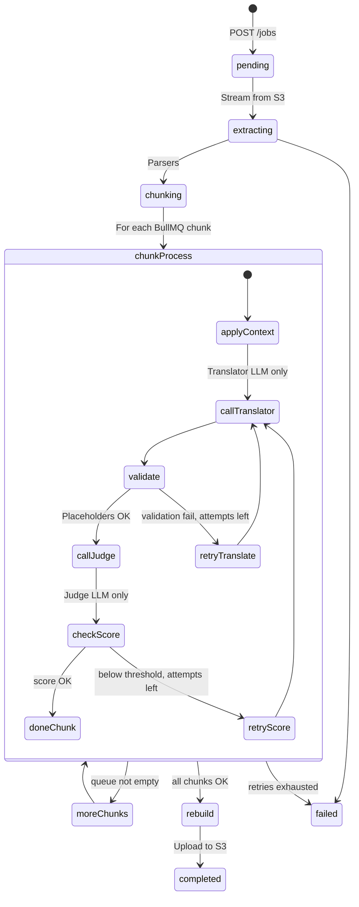

# Aptos Translate AI v2 — Architecture Blueprint

## Stack Summary (one-liner per layer)

| Layer | Choice |
|---|---|
| **Monorepo** | Turborepo + pnpm workspaces |
| **Frontend** | Next.js 15 (App Router) · TypeScript · React 19 |
| **UI Kit** | shadcn/ui (Radix primitives) · Tailwind CSS v4 · custom design tokens |
| **Client State** | TanStack Query v5 (server) · Zustand (local UI) |
| **Forms** | React Hook Form + Zod |
| **API Client** | Auto-generated via `openapi-fetch` + `openapi-typescript` from NestJS OpenAPI spec |
| **Backend** | NestJS 11 · TypeScript · Fastify adapter (better for high throughput) |
| **API Contract** | OpenAPI 3.1 auto-generated from `@nestjs/swagger` decorators |
| **Job Queue** | BullMQ (Redis 7) — essential for batching 120k+ string translations with bounded concurrency |
| **Database** | PostgreSQL 16 · Prisma ORM (Multi-tenant architecture) |
| **File Storage** | S3-compatible (AWS S3) with direct client-side uploads (presigned URLs) for unlimited file sizes |
| **Auth** | Auth.js v5 (Google OAuth) · Passport JWT (backend) |
| **Observability** | OpenTelemetry SDK → Grafana stack (Tempo, Loki, Prometheus) |

---

## Monorepo Structure

```
aptos-translate-ai/
├── turbo.json
├── pnpm-workspace.yaml
├── package.json
├── .env.example
│
├── apps/
│   ├── web/                      # Next.js 15 frontend
│   │   ├── app/                  
│   │   │   ├── (auth)/           # Google OAuth sign-in
│   │   │   ├── (dashboard)/      # Authenticated tenant shell
│   │   │   │   ├── translate/    # Upload & configure translation
│   │   │   │   ├── jobs/         # Job history & detail
│   │   │   │   ├── prompts/      # System + user prompt editors per source→target pair
│   │   │   │   ├── glossary/     # Term preferences (source → preferred target)
│   │   │   │   ├── health/       # Deps grid, LLM latencies, build info from /version
│   │   │   ├── layout.tsx
│   │   │   └── page.tsx          
│   │   ├── components/
│   │   │   ├── ui/               # shadcn primitives
│   │   │   ├── translate/        
│   │   │   ├── jobs/             
│   │   │   ├── prompts/          # PromptEditor, LanguageSelector
│   │   │   ├── glossary/         # TermTable, TermModal
│   │   │   └── health/           # LivePingChart, ModelSwitcher
│   │   ├── lib/                  # api-client, queries, stores
│   │   └── styles/
│   │
│   └── api/                      # NestJS backend
│       ├── src/
│       │   ├── main.ts           
│       │   ├── app.module.ts
│       │   ├── common/           # TenantGuard, extract-tenant interceptor
│       │   ├── auth/             # Google OAuth validation
│       │   ├── jobs/             # Job CRUD, SSE, batch diagnostics
│       │   ├── translation/      # Batching logic, orchestration
│       │   ├── extractors/       # Streaming parsers (XML, JSON, CSV) for huge files
│       │   ├── regenerators/     # File rebuilders (preserving symbols/structure)
│       │   ├── llm/              # Amazon Bedrock (Converse API) adapters
│       │   ├── prompts/          # [NEW] Prompt management DB service
│       │   ├── glossary/         # [NEW] Terminology override service
│       │   ├── scoring/          # Quality scoring via Bedrock
│       │   ├── files/            # S3 presigned URL generation
│       │   └── health/           # Model reachability & active model config
│       └── prisma/
│           └── schema.prisma     # Multi-tenant schema
│
└── packages/
    ├── contracts/                # Shared Zod schemas & types
    ├── eslint-config/            
    └── tsconfig/                 
```

---

## Multi-Tenant Architecture & Data Model

### Data isolation (always)

Every core row is scoped to a `Tenant` so the **data model** stays multi-tenant: one schema, `tenantId` on all relevant tables, and `TenantGuard` + query helpers so handlers never leak across clients (`where: { tenantId: req.user.tenantId }`).

### Deployment: “one client, one instance” (operational)

**Product vision:** most POS customers run **a dedicated stack** (own cluster/VM, own Postgres, own Redis, own S3 prefix/bucket) so blast radius and compliance stay small. The same codebase supports that: environment/config points at *that* customer’s resources; **one logical tenant (or a small set) per deployment** in practice. A future shared-SaaS mode can host many `Tenant`s in one deployment—the schema already supports it.

*When a user signs in, they are mapped to their `Tenant` for that instance. A dedicated deployment typically maps 1:1 to one customer.*

### Dual prompts: **system** vs **user** (per language **pair**)

Prompts are **not** a single blob. For each `(sourceLang, targetLang)` the tenant may configure **two** layers—both editable in the UI and stored separately:

| Field | Role |
|--------|------|
| **System prompt** | Global rules for the translator: role, POS context, non-negotiables (brevity, placeholders, no extra text). Injected as the “developer/system” message where the model API allows it, or prepended with clear delimiters. |
| **User prompt** | Per-job string template: tone, product-specific phrasing, variable slots (`{{source_text}}`, `{{glossary_block}}`, etc.). *Different for each target language* because copy norms differ (e.g. formal German vs. concise English). |

The orchestrator always loads **the pair** for the active job’s `sourceLang` → `targetLang`. Missing keys fall back to vetted product defaults, then to a safe global default—never empty strings silently.

```prisma
// Example Prisma concept (illustrative)
model Tenant {
  id               String   @id @default(uuid())
  name             String
  activeTranslator String   @default("bedrock")
  activeScorer     String   @default("bedrock")
  users            User[]
  jobs             Job[]
  promptTemplates  PromptTemplate[]
  termPreferences  TermPreference[]
}

/// One row per tenant per source/target language pair
model PromptTemplate {
  id          String   @id @default(uuid())
  tenantId    String
  sourceLang  String   // e.g. "en"
  targetLang  String   // e.g. "de" — distinct row from "en" -> "es"
  systemText  String   @db.Text
  userText    String   @db.Text
  version     Int      @default(1) // for audit / rollback
  updatedAt   DateTime @updatedAt
  tenant      Tenant   @relation(fields: [tenantId], references: [id])

  @@unique([tenantId, sourceLang, targetLang])
}

/// Preferred target wording when the source has synonyms — only one is “right” for this POS
model TermPreference {
  id           String   @id @default(uuid())
  tenantId     String
  sourceLang   String
  targetLang   String
  sourceTerm   String   // phrase or single token as extracted from glossaries
  preferredTarget String @db.Text
  /// Optional: notes, case sensitivity, whole-word only
  notes        String?
  tenant       Tenant   @relation(fields: [tenantId], references: [id])

  @@index([tenantId, sourceLang, targetLang])
}

model User {
  id        String @id @default(uuid())
  email     String @unique
  tenantId  String
  tenant    Tenant @relation(fields: [tenantId], references: [id])
}
```

---

## NestJS Module Breakdown & Advanced Features

| Module | Responsibility | Key Features |
|---|---|---|
| **JobsModule** | Job state & UI tracking | SSE streams for live frontend updates. |
| **TranslationModule** | Orchestration & **Batching** | Splits 120k+ strings into **token-aware** BullMQ jobs (chunk size + concurrency caps). **Translator** and **Judge** are **separate** LLM calls: translate first, score second. Implements **retries** on transport errors and **re-translation** when judge score is below a tenant threshold. |
| **PromptsModule** | System + user prompts | CRUD for **system** and **user** prompt bodies per `source` × `target` language. Versioning/audit for compliance. |
| **GlossaryModule** | Term **preferences** (synonym disambiguation) | Maps source phrase → **preferred** target string so reviewers pick the *one* correct POS wording when synonyms exist. Injected as a block in the user prompt (and/or few-shot list). |
| **ExtractorsModule** | Parsing unlimited files | Uses streaming parsers (e.g., `sax-js` for XML, `stream-json` for JSON) to parse files of any size without blowing up RAM. |
| **RegeneratorsModule** | Rebuilding files | Strict logic to preserve original file structure, XML attributes, POS symbols, and placeholders exactly as they were. |
| **LlmModule** | **Two** provider roles | **Translator** and **Judge** both use **Amazon Bedrock** (separate model IDs): translate produces JSON batches; judge scores—**never** the same combined call. |
| **HealthModule** | Observability + control | Readiness: Postgres, Redis, S3, translator, judge. Latency percentiles, last error strings. `GET /version` (build). `PUT` active models per tenant. **No secrets** in responses. |

---

## Core API Endpoints & Job Lifecycle

### Auth (Google)

```
POST   /auth/google/callback → { accessToken, tenantId }
```

### File Storage (Unlimited Size)

```
POST   /files/presigned-url  → { uploadUrl, fileKey }
         Frontend requests URL, uploads directly to S3 (bypassing NestJS RAM limits).
```

### Prompts (system + user, per language pair)

```
GET    /prompts/:sourceLang/:targetLang
       → { systemText, userText, version, updatedAt }

PUT    /prompts/:sourceLang/:targetLang
       body: { systemText, userText }
       → Updated template; optional optimistic version check to avoid clobbering.
```

`sourceLang` / `targetLang` are BCP-47 (or your internal code set); **each target language** has its own row so copy and “prefer formal/informal” can differ (e.g. `en → de` vs `en → es`).

### Term preferences (synonym / “one right word” for POS)

```
GET    /glossary?sourceLang=&targetLang=   → List term rows (paginated, searchable)
POST   /glossary                            → { sourceTerm, preferredTarget, ... }
PATCH  /glossary/:id
DELETE /glossary/:id
```

The translation pipeline **must** include this block in context for the batch (subject to token budget); overlapping terms resolve by **longest match** or explicit rules documented in the product.

### Jobs (translator ≠ judge, batches, diagnostics)

```
POST   /jobs
       body: {
         fileKey, sourceLang, targetLangs[],
         batchSize,                    // e.g. token- or string-count cap per BullMQ child job
         minTranslationScore,          // optional tenant override; default from env
         maxBatchRetries
       }
       → { jobId }

GET    /jobs/:id
       → State, per-target progress, failure summary, score histogram (aggregated)

GET    /jobs/:id/events
       → SSE: phase changes, per-batch % (e.g. 45k/120k strings), last scores, **retry** notices

GET    /jobs/:id/result
       → { translatedFileUrls, reportUrl, qualitySummary }

GET    /jobs/:id/batches/:batchId
       → For support: that chunk’s last error, scores, **why** a retry was triggered
```

**Quality gate:** for each string (or per chunk policy), the **judge** LLM returns a score + flags. If the score is below `minTranslationScore` (or a hard failure: empty output, bad placeholders), the orchestrator **re-translates** that unit up to `maxBatchRetries` with tightened prompts and/or a logged **diagnostic** code (`PLACEHOLDER_MISMATCH`, `SCORE_LOW`, `PROVIDER_429`, etc.).

### Version & build (for ops and support)

```
GET    /version
       → {
           service: "aptos-translate-api",
           version: "1.4.2",            // from package.json or CI-injected
           gitSha: "abc123f",
           buildTime: "2026-04-20T12:00:00Z",
           node: "22.x"
         }

GET    /version/web
       (optional) Same for the Next app via same pattern or a small public config route.
```

Frontends can show a small “About / Build” in settings and support can ask “what SHA is live?”

### Health, dependencies & model switching

**Readiness and liveness** are split where useful: `GET /health/live` (process up), `GET /health/ready` (DB + Redis + S3 can be reached in ≤ timeout).

**Rich dependency panel (single JSON for the dashboard):**

```
GET    /health/deps
       → {
           postgres: { status: "up", latencyMs: 2 },
           redis: { status: "up" },
           s3: { status: "up" },
           llm: {
             translator: { id: "gemini", status: "up", latencyMs: 45, p95Ms: 120, lastError: null },
             judge: { id: "bedrock", status: "degraded", latencyMs: 800, lastError: "ThrottlingException" }
           }
         }
```

**Model routing (per tenant, never mixed in one request):**

```
PUT    /health/active-models
       body: { translator: "bedrock", scorer: "bedrock" }
       → Validates providers exist; applies to `Tenant` for subsequent jobs.
```

### Job state machine: dual LLM, batches, retries, “what went wrong”

- **Batches:** 120k+ strings are **never** one API call. Workers pull **chunk jobs** (size from `batchSize` + token estimator). Concurrency is capped so Redis/LLM quotas stay healthy.
- **Order:** for each unit/chunk: **(1)** apply term preferences + prompts → **(2)** **Translator** LLM only → **(3)** validate placeholders → **(4)** **Judge** LLM only → **(5)** if hard fail, low score, or rate limit → **retry** with backoff; if still bad → mark failed with **diagnostic** + optional partial output policy (product decision).
- **Failure records:** `Job`, `JobBatch` (or equivalent) store `lastErrorCode`, `attempt`, `judgeScore`, so UI and `GET /jobs/:id/batches/:batchId` can answer **what went wrong**.



*Translator and judge are **always** different configured adapters in code so the product cannot use one model for both roles in the same pass.*

---

## Frontend Design & UX

### Design Philosophy

Professional POS/ERP localization tool. **No generic AI purple gradients.** Clean, high-contrast, data-dense interface (think Vercel or Linear).

### Key pages

1. **Translate wizard**  
   File upload, target languages, and **Advanced**: preview **system** + **user** prompt snippets for the selected pair, and **term preferences** that will apply. Show estimated batch count for 120k+ jobs.

2. **Health & dependencies (first-class, not a debug screen)**  
   - **Status grid:** Postgres, Redis, S3, **Translator**, **Judge**—each with status chip, last check time, p50/p95 latency where relevant, and **last error** (one line, copyable).  
   - **Sparklines / time window** (last 24h or session) for LLM latencies.  
   - **Model toggles** only when the dependency is at least `degraded` or when the user is admin—avoid accidental changes.  
   - Link or inline **build:** version + git SHA from `GET /version` so ops can confirm what is live.

3. **Prompts manager**  
   - Tabs or table: **one row per `source` → `target`**.  
   - Two editors side-by-side: **System** (non-negotiables, POS context) and **User** (tone, variables).  
   - Variable legend: `{{source_text}}`, `{{glossary_block}}`, etc.  
   - Optional **preview** of assembled messages (read-only) before save.

4. **Term preferences (synonym lock-in)**  
   - CRUD: source phrase → **preferred** target; search and bulk CSV import for large lists.  
   - Help text: *“For POS, pick the one wording cashiers and customers should always see.”*

5. **Live job view**  
   - Progress: **strings completed / total** (e.g. 48,200 / 120,000) and current phase.  
   - Feed of last **N** items with **translator output**, **judge score**, and badge if a **retry** happened.  
   - Expand a row to see **diagnostic** (`SCORE_LOW`, `PLACEHOLDER_MISMATCH`, …) and link to **batch detail** for support.

---

## POS context & guard rails

These are product rules enforced in **prompts**, **validation**, and **judge** criteria—not only in the UI.

| Area | Guard rail |
|------|------------|
| **Brevity** | System prompt states max length or “shortest clear POS label”; validator warns if output much longer than source (configurable). |
| **Placeholders** | Reject or retry if `{0}`, `%s`, XML placeholders, or agreed tokens are missing or reordered. |
| **No extra markup** | Judge flags hallucinated HTML/Markdown not present in source (policy: retry or fail). |
| **Term preferences** | Always injected when budget allows; judge checks preferred term usage when the source term appears. |
| **Clarity** | User prompt can demand plain language for **POS operators** and shoppers (instance-tunable). |
| **Safety** | No secrets in UI logs; PII in file names/contents stays in tenant S3; audit log for model and prompt changes. |

---

## Critical execution details

1. **“No limit” files:** S3 presigned uploads; workers stream from S3 into extractors. No full-file buffer in the API process.
2. **120k+ scale:** Chunks in BullMQ; horizontal workers; back-pressure via queue concurrency; **idempotent** batch processing where possible so retries do not double-apply.
3. **Two LLM roles:** Translation and scoring use **separate** clients/config in code; different API keys/quotas; judge never reuses the translator’s completion as “ground truth” without a second call.
4. **Retries:** Exponential backoff for 429/5xx; **re-translate** when validation or score fails, up to a cap; every terminal failure has a **machine-readable** `errorCode` for the UI and support.
5. **Bedrock (judge):** IAM-authenticated; only aggregate or redacted details returned to the client.

---

*End of blueprint. Execution follows this plan; implementation details in repo and OpenAPI stay the source of truth for exact fields.*
